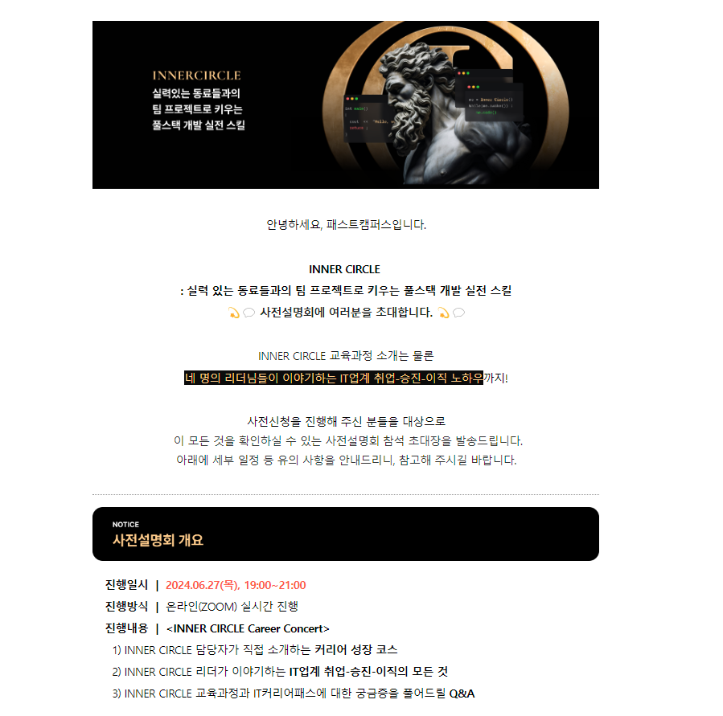

# 물경력 개발자의  inner circle 도전

이직을 준비중인 와중에,

패스트 캠퍼스에서 하는 inner circle에 최종 선발 되어서, 그 내용을 기록해 보고자 한다. 

내가 다니는 회사는 it si, 솔루션 회사이다. it 종사자라면 알 고있을 테지만, si,솔루션 회사에 취업하게 되면
개발자로써 역량을 키우기가 굉장히 애매해지고 어려워진다.

이유는 따로 말안해도 알것이다.

내가 다니는 회사는 굉장히 레거시한 기술들을 사용하고 있어서, 신입이 들어와서 좋은 개발자가 되기에는 힘겨움이 있지만 
처음 신입으로 들어올때는 내가 열심히 하면 되겠지 라고 생각했다.

### 근데 아니였다.

회사 환경이 정말로 중요한거같다. 이 회사는 이 업계에서 이름이 꽤 있어서 안정적인 회사이다. (중소임)

그래서 그런지 사람들이 개발에 대한 욕심이 없었다. 이런 기술도 써보고 서로 코드리뷰하고 테스트코딩하고
이런것들이 전혀 없는 회사였다...

#### 제일 심각했던건 나도 이런 회사의 환경에 적응하고 맞춰져가고 있었다는 것이다.

# ㅇㅁㅇ ..;;

풀스택 개발이지만 프론트앤드 개발자를 지향하는 나는 

1. 나름 인프런 같은 곳에서 인강도 듣고 
2. 개인 프로젝트도 진행해보기
3. 전문서적도 사서 읽어보기
4. 비전공자라 방통대도 입학해서 cs지식 채우기
5. 정처기, sqld 자격증 취득하기

다 해보았지만 뭔가 불안하고 물경력만 쌓인다는 느낌이 들었다. 그렇다고 나가자니.. 내가 부족한거같고
3년 동안 10개가 넘는 프로젝트에 투입되어 개발하고있지만, 이직이 무서웠다.

그러다 올해 친형이 개발자로써는 꽤 좋은 회사로 이직을 성공한걸 봤고 나도 이직하고 싶어졌는데
너무 겁이 났다... ㅜㅜ

그러던 도중 발견한것이, 패스트캠퍼스 이너서클이다. 취업, 이직 노하우도 전수해 준다하고
3년차 이상 개발자들끼리 프로젝트도 할 수 있다고 하니.. 정말 좋은 기회일거같다.

사전 설명회를 듣고, 시작하길 잘했다는 생각이 들었다.
패스트 캠퍼스에서 정말 많은 것을 준비했다는 것도 알았다.
이제 나만 잘하면 된다. 잘해보자