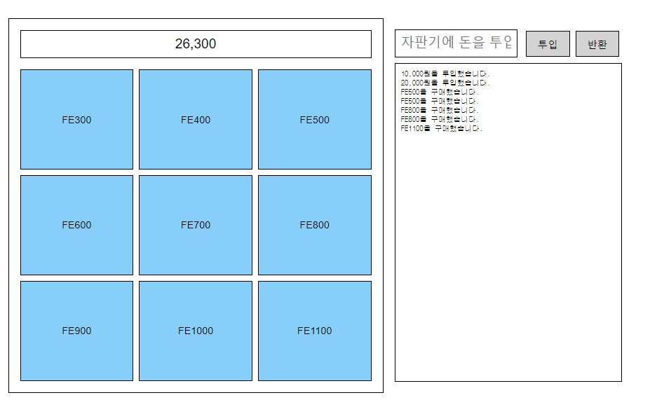

# 1 주차 후기되시겠다.

맛보기 api 과제 이후에, 바닐라 스크립트로 자판기를 구현해 보라는 과제와 자신있는 프레임워크로 하라는 과제가 있었다.

### 바닐라 js로 자판기
오랜만에 바닐라 자바스크립트를 하니까 재밌기도하고, 익숙치 않았다. 그래도 금방 끝냈다.

주말에는 김태곤 리더님의 코드리뷰가 있었다.

1. 코드의 일관성을 유지할것
2. 기능이 잘 돌아간다면 왜 이렇게 했는지가 중요하다.

예를 들어 queryselector를 사용했는데 다른 것도 있는데 왜 이 css 선택자를 사용했는가에대한 답변같은걸 준비하라고 하셨다.

개인적으로 이직 준비로 인해서 사전과제를 해야하는 상황이 발생해서

왔다갔다하면서 하느라 양쪽다 준비가 미흡했던거같다.

### react로 자판기

이거에 대해서는 별 말씀 없으셨다. 시간이 모잘라서 못보신듯?

그래도 피가되고 살이되는 중요한 지적을 해주셨다.. 나는 평소에 왜라는걸 생각 안하고 코드를 짰고,

기능만 되면 된다고 생각했는데, 이번 이직 사전과제를 할때에는 왜? 라는걸 생각하면서 코드를 짰고,

더 매끄러운 코드가 된거같다. 아님.. 말구....(시무룩..)

2,3주차에는 npm에 모듈 만들어서 퍼블리싱까지가 과제라는데 잘 될런지

투 비 컨티뉴~
