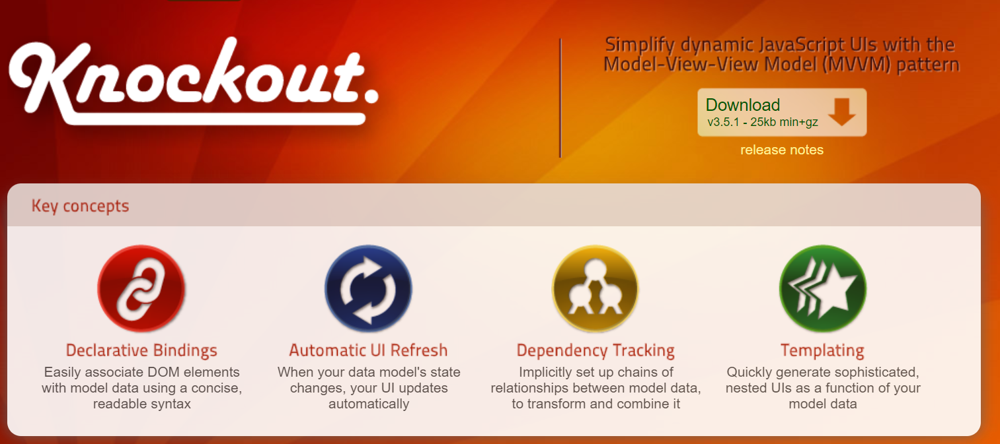

# KnockoutJS 란?

직접적인 DOM조작이 아니라 tmeplate를 통해서 선언적으로 개발을 지원해준다.

## 핵심 기능

### 1. 선언적 바인딩

- 간결하고 읽기 쉬운 구문을 사용하여 DOM요소와 모델데이터와 쉽게 연결

### 2. 자동 ui 리프레시

- 데이터 모델의 상태가 변경되면 UI가 자동으로 업데이트 된다.

### 3. Dependency tracking

- 모델 데이터 간의 관계 체인을 암시적으로 설정하여 변환 및 결합

### 4. 템플릿

- 모델데이터의 기능으로 정교하고 중첩된 UI를 빠르게 생성
- DOM 대신 템플릿

### 어떻게 자동으로 실행 시켜?

- observable
- 데이터의 변경 감지를 하는 옵져버가 필요하다.

## 어떤 문법을 사용하고 어떤 메서드를 제공하는지를 알 필요는 없다.

- 그러나 현대 프레임워크들에게 큰 영감을 줬떤 라이브러리이기때문에
- 중요한 단계의 라이브러리이다.

# DOM API를 사용하지 않고 웹개발이 가능하게 됐다.
